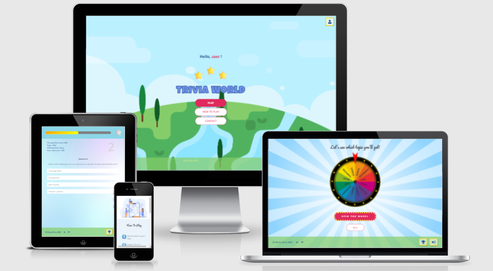
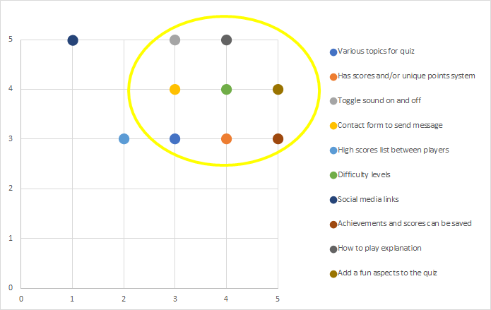
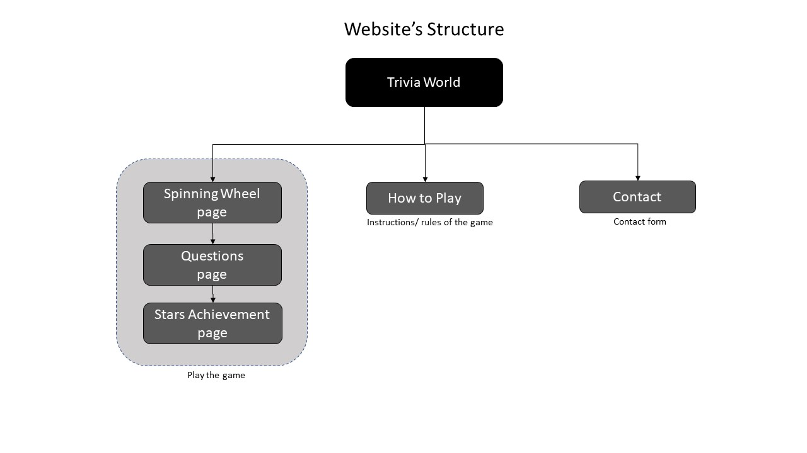
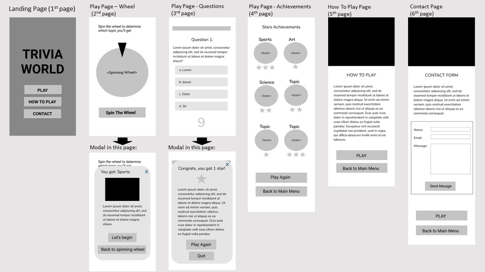
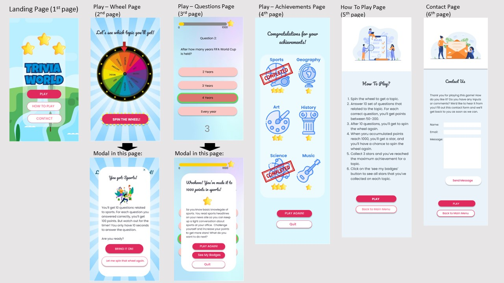
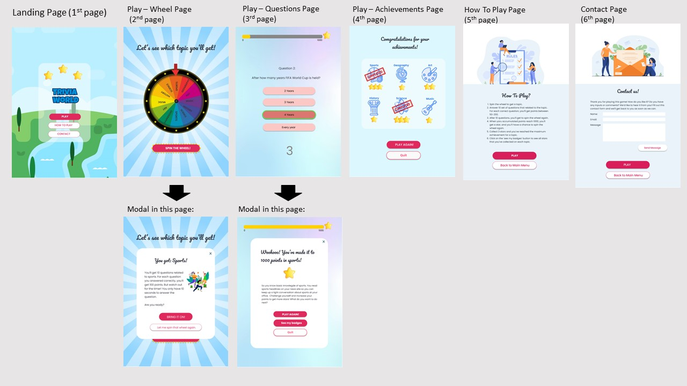
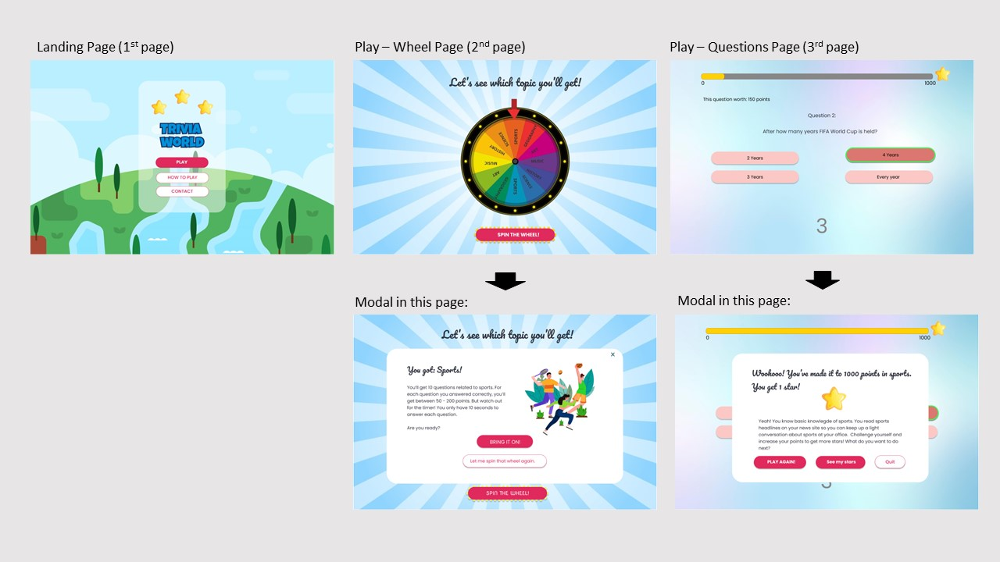
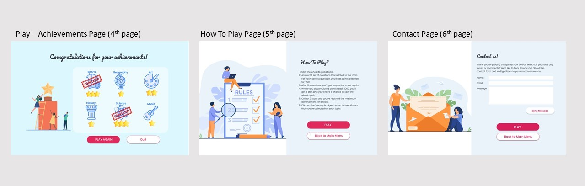
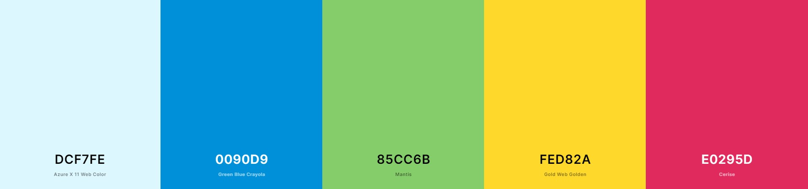

# Trivia World

  

[View live website here](https://dissyulina.github.io/trivia-world/index.html)

 

**Table of Contents**

------

## Introduction   
Welcome to the Trivia World! 
Trivia World is a website-based quiz/ trivia game in various topics - Sports, Geography, Computer, Film, Music, and Science. The game also features a spinning wheel to assign a topic and a stars achievement system that differentiates it from other quiz games. It also saves scores in the user’s local storage so the user can resume the game and allows multiple user names on the same device.    

Please note that this website game was created for the Code Institute’s Milestone Project 2 as part of their Diploma in Full Stack Software Development. The requirements are to make an interactive front-end website, using HTML, CSS, JavaScript. The site should respond to the users’ actions, allowing users to actively engage with data, alter the way site displays the site displays the information to achieve their preferred goals.   

 

## UX Development Plane   
### 1. Strategy Plane   

#### **User Stories**   
Strategic UX research was done through interviews with a few potential users. 
- **First Time Visitor Goal**   
   As a first time visitor, I want to:   
   a. Easily navigate throughout the site between pages, to play or to quit the game.   
   b. Play the game intuitively without first reading the instruction.  
   c. Finding the instructions on how to play the game if it is needed. 
   d. Be able to choose different topics. 
   e. Play the game with a great user interface visually.  
   f. Have clear information/ heads up display inside the quiz’s questions, i.e. which topic I get, how much point does this question is worth, the progress bar, etc.  
   g. View my achievements.  
   h. Be able to save my achievements so that I can resume them later.   
   i. Be able to change player/ username so my friends can try to play it on the same device.   
   j. Play a game with sound effects which will enhance the gaming experience.   
   k. Toggle the sound on and off.   

- **Returning/ Frequent Time Visitor Goal**   
   As a returning / frequent visitor, I want to:  
   a. Resume the playing that I did before, with my achievement still saved in the game.   
   b. Send suggestions to the developer to improve the game.  
   c. Know in which topics I have full achievements. 
   d. To be challenged with different difficulty levels. 

 

#### **Online Research**
As a part of the planning process, online research was done to gain some inspiration on UI and UX of a quiz game, including:
1. [Squla](https://leukleren.squla.nl/demo) app
2. [Kahoot!](https://kahoot.com/)
3. Similar quiz games created by Code Institute peers (searched in channel peer-code-review in Slack)   
 

#### **Project Goals**  
The primary goal of Trivia World is to provide a web-based interactive quiz game, that is different from other typical quiz games. The game has to be fun and challenging to attract users to play the game until they can achieve rewards.   
    

#### **Player Goals**   
The target user for this game is:
-	Late teens to adult, 15 – 40 years old  
-	Consider themselves quite knowledgeable in various topics  
-	Enjoys quiz games  

The player is looking for:
-	A fun and challenging quiz game to play
-	Stars to be achieved, that creates a sort of goals/ target to be accomplished from the game.
-	Scores and achievements that can be saved  
 

#### **Developer Goals**   
The developer is looking to:
-	Create a fun game that they would play themselves
-	Demonstrate their skills and logic in using JavaScript, fetch API, and using local storage effectively.   

#### **Strategy Table**  
Based on the user stories and goals above, I brainstormed all of the opportunities that could be implemented in the game. All of these opportunities were mapped based on their importance (driven by goals and user needs), and viability (given limited time and resources), to determine which opportunities were going to be included and which were not.   
Opportunities / Features | Importance | Viability
   --- | --- | ---
   A. Various topics in a quiz | 3 | 3
   B. Has scores and/or unique points system | 4 | 3
   C. Toggle sound on and off | 3 | 5
   D. Contact form to send message | 3 | 4
   E. High scores list between players | 2 | 3
   F. Difficulty levels | 4 | 4
   G. Social media links | 2 | 5
   H. Achievements and scores can be saved | 5 | 3
   I. How to play explanation | 4 | 5
   J. Add a fun aspect to the quiz | 5 | 4

The chart below is the mapping of all of the opportunities. The yellow circle signifies which opportunities/ features have the highest combination of importance and viability.   

   

### 2. Scope Plane  
Based on the mapping in the Strategy Plane, I decided to include these features below in the game.
1.	A spinning wheel   
A spinning wheel is used to decide which topic the user will get. 
Instead of letting the user straightforwardly choose the topic, I decided to incorporate a spinning wheel to decide which topic the user will get. A spinning wheel serves two main purposes of the mapping in the Strategy Plane, which are:   
    -	Gives various topics to the game, and acts as a decision-making tool.   
    -	Adds a fun aspect of the game, as many people enjoy spinning the wheel.   
2. Unique score/ points system   
 I decided to make a unique points system as follows:   
   -	Every question is assigned points if answered correctly
   -	For every 1000 points reached in a topic, the user will be rewarded a star in that topic.
   -	The user can get a maximum of 3 stars on each topic. When a topic has 3 stars, the achievement for that topic is completed.  
3. Points and stars are saved in the local storage of the user’s device   
The achievements - points and stars, would be saved in the local storage of the device. At the landing page, the user is asked to input the username. If the username exists, the game will load the achievements. This allows the user to resume the game whenever they like, and other users can also use the same device and create their username.   
4. Difficulty level goes up after each star achieved   
Players can enjoy being challenged in the game because as the player reaches a star, the difficulty level of the next set of questions goes up as well.
    - For users that have 0 stars on a topic, the difficulty level of the corresponding topic is Easy.
    - For users that have 1 star on a topic, the difficulty level of the corresponding topic is Medium.
    - For users that have 2 and 3 stars on a topic, the difficulty level of the corresponding topic is Hard.   
5. How to play explanation   
The user can access a How to Play page if they need it. In the game, I will use descriptive messages, buttons, and other established conventions, therefore the user can play the game intuitively without checking out the rules/instructions first.     
6. Contact form   
The user can easily contact the developer through a contact form.   

And some functionalities in the game to guarantee the user has a great user experience:
1. The user can toggle the sound button on and off
2. The user can navigate easily through the game, quit or play again    
  

 

### 3. Structure Plane  
The game was organized in a Hierarchical Tree Structure that ensures the user can navigate easily and intuitively.   

   

There are 6 pages in planning: 
1. Landing page, as a main menu page.    
2. Spinning Wheel page, where the user chooses a topic.   
3. Questions page, where 10 set of questions in that topic appears one by one.   
4. Stars Achievement page, where the user can see all the stars that they have earned.   
5. How to Play page, where the user can find the instructions or rules for the game.   
6. Contact page, where the user can send a message to the developer via a contact form.   

    

### 4. Skeleton Plane  
Wireframes were created using Figma to design the navigation and interface of the website. One wireframe was created for mobile devices, according to the mobile-first design approach. The wireframe was only a rough sketch design of each page plus modal pop-ups.    

 

    

### 5. Surface Plane  
For a better and clearer visualization before coding, and also to check if the color scheme and images match and work great together, a high-fidelity mockup for mobile, tablet, and desktop was made and can be found below.

High fidelity mock-up for mobiles:
   

High fidelity mock-up for tablets:
 

High fidelity mock-up for desktops:
 
 

   #### **Color Scheme**  
   The overall theme of the game was blue and green, which were derived from the hero image. Using [Coolors](https://coolors.co), I add three colors from the hero image, and the yellow color of the star image, and then I generated one more color that fits well with those three colors. The result was a magenta color and I will use this color for all buttons.     
     

   #### **Typography**  
   All of the fonts were sourced from [Google Fonts](https://fonts.google.com).   
   - Main font: Open Sans   
   Open Sans is used as the main font, for all paragraphs and buttons. Open Sans was chosen because it has a modern and clean style. Also following the recommendation in Google fonts of popular pairing font with Pacifico.   
   - Secondary font: Pacifico    
   Pacifico is used as the header (h1 – h5) font for the website. It was chosen first since I wanted to choose a beautiful and impactful font for all headers.   
   - Tertiary font:   
   The tertiary font is just used for the game title on the landing page. I wanted to use a fun a thick font to grab the user’s attention since that is the first impression of the website from the user’s perspective.   

   #### **Imagery**  
   - Hero Image was chosen because it’s bright, fun, and capturing attention on the first impression. It is also picturing a curve landscape that corresponds to the “World” word of “Trivia World”.   
   - Every image inside the game were carefully chosen to corresponds with each other, mostly using a blue color theme.   
   - Icons in the achievement page were chosen to keep the blue color theme aligned with other images.   
   - Star image was the only one that differs from the entire theme, as it has a fun and cartoonish feel to it. It was chosen so that it stands out within the game so that the player can differentiate it from the other background images.

    

## **Features**  
### **Existing Features**  
#### **General Design Features**  
   - **Fully responsive** - Each page of the game is fully responsive on all device sizes and features intuitive navigational buttons.   
   - **Footer (toggle sound and direct access to the achievement page)** - Footer is available at the bottom of all pages, and the same for all pages to ensure easy control and navigation. In the footer there are:   
      * Toggle sound on and off, to allow users to mute or to play the sound no matter on which page the user is currently at.   
      * Access button to the achievement page, to allow users to go straight to their achievement page.  
      *  Copyright remarks and links to the developer’s GitHub and LinkedIn.   
   - **Quit (and save) button** - Quit button functions to quit the game, save the users’ achievements, and bring the users back to the Landing Page. This button is placed on all the pages, except in the middle of the 10 questions on the Question page. However, after the 10 questions are finished, a modal pops up, and the users can click the Quit button to quit the game.   
   - **Sound effects** - Sound effects were added across the game to enhance user experience in playing the game:   
      * On the wheel when it’s spinning   
      * On modal pop-up after the wheel spun (topic result from the spinning wheel)   
      * On the answer choice if it’s clicked as an auditory feedback, if the answer is correct or wrong   
      * On modal pop-up, after 10 questions are up   
      * On modal pop-up when the user reaches a star   

    

#### **Page Design Features**     
1. **Landing Page/ Main Menu Page**   
   - There’s a conditional system that a user gets when they are entering the Landing Page.
      * **Modal to input username** - If the user has never played the game on that device before (no data in the local storage is detected), the user will see a modal pop-up that welcomes the user to the game and prompts the user to input their username.   
      * **Welcome greetings to last player** - If the user has played the game on that particular device before, on the landing page there’s a welcome greeting with the last username that played on that device before.   
   - **Change Players Button** - Still related to the username, the change player button is available at the top left of the landing page, to allow the users to change players even if they are using the same device. If the users input an existing username, the game will load all the username’s previous data and achievements. All of the users’ achievements will be saved on the local storage so that the user can conveniently resume their playing.  
   -  On the landing page, there are 3 main buttons: Play button, How To Play button, and Contact button, which all will lead to other pages. As the users click the Play button, they will be brought to the Wheel page, the How To Play button will bring users to the How To Play page and the Contact button to the Contact page.  
   - Footer is placed at the bottom of the page.   

2. **Wheel Page**   
   - **Easy accessibility of playing the game** - To ensure easy accessibility of the game playing from wherever page the users are currently at, there are Play buttons placed on all pages across the website. The users will be brought to this Wheel page when:   
      * The users click the Play button on the Landing page, How to Play page, Contact page, and Achievement page.   
      * The users click the Play Again button on the modal pop-up on the Question page, after 10 questions are up or after the users get a star.   
   - **Spinning Wheel** - The Wheel page performs as the first page of the playing itself. On this page, the users will spin a wheel to determine a topic for the quiz. Six topics are spread into 12 sections in the spinning wheel: Sports, Music, Film, Computer, Geography, and Science.   
   - There are two buttons on the Wheel page:  Spin The Wheel button, which functions as an action button to spin the wheel and the Quit button, which will take the user back to the Landing page.   
   - **Modal pop-up to display the topic result** - When the users click the Spin The Wheel button, the wheel spins. After the spinning ends a modal pops up that displays the topic that the user gets from spinning the wheel. In the modal, there’s also a short explanation of the rules of the game. From this modal, the user can choose to proceed to the questions by clicking the Bring It On button, or the user can choose to spin the wheel again by clicking the Let Me Spin That Wheel Again button.   
   - Footer is placed at the bottom of the page.   

3. **Question Page**   
   - After the users click the Bring It On button from the modal in the Wheel page, the game will take the users to the Question page.   
   - **Spinning page loader** - As the questions are being fetched, there’s a spinning loader icon displayed until the questions are loaded to the page. This ensures the user to know that the game is in the middle of loading something, instead of it’s not working.   
   - **Progress bar and stars** -  On top of the page, there’s a progress bar that will be filled with accumulative points that the users get when their answer is right. On the top right of the page, there’s a gray star. When the progress bar is full, which means the user gets 1000 points, the star image turns yellow, and a modal pops up. 
   - **Heads up display** - Below the progress bar, on the left side, there’s the heads-up display that tells the user: how many points the question is worth, which topic it is, the difficulty level, and the total score.
   - **Timer** - Below the progress bar, on the right side, there’s a timer. As the timer counts down to 0, the question moved on to the next question.
   - **Answer feedback** - Below the statistic and the timer, there are the question and multiple choices answers. These questions and answers are fetched according to the topic using API from Open Trivia DB. As users answer correctly, the chosen answer turns green, while when it's incorrect, the clicked answer turns red, giving the user answer feedback.
   - **Modal response** - A modal wil pop up when:
      * The users get a star (1000 points), or   
      * The users have answered 10 questions, or   
      * The timer is up, on the 10th question.   

      The text inside the modal differs according to which of those three conditions above made the modal appear.  From this modal the users can navigate to other pages using three buttons: Play Again button, Go To Achievement Page button, and Quit button.   
   - Footer is placed at the bottom of the page.   

4. **Achievement Page**  
   - **The display of all stars** - All of the stars that the user got for each topic are displayed on the Achievement page.   
   - **Complete achievement sign** - When a user has a maximum number of stars for a topic (3 stars), there’s a complete sign with a check-list icon below that topic, which indicates that the achievement for that topic has been completed.   
   - There are two buttons on this page: the Play Again button and the Quit button.   
   - Footer is placed at the bottom of the page.   

5. **How To Play Page**  
   - **Instructions of the game** - How To Play page can be accessed via the Landing page. How To Play page consists of rules and instructions of the game.   
   - There are two buttons on this page, which are: Play button, so the users can immediately play the game without going back to the Landing Page first, and Back To Main Manu button that will bring the user to the Landing page.   
   - Footer is placed at the bottom of the page.  

6. **Contact Page**  
   - **Contact form** - Contact page can be accessed via the Landing page. The contact page consists of a contact form where the users can send a message to the developer.  
   - **Confirmation response** - After the form is submitted, the text on Send Message button turns to “Sent”, as a response confirmation to the user that the form has been successfully sent. The user will also get a thank you email in their inbox (given the user provided a working email address), and the developer will also get the message in the inbox. This feature was made using EmailJS' service.   

    

#### **Features to be implemented in the future**   
Due to limited resources (time constraint, skill of the developer at the moment, and other reasons), some features couldn't be implemented now. In the future on the next development phase, these features would be great addition to the game:   
- Background music on landing page and achievement page.   
- Branching out to add more topics, for example, Animals, Environment, Art, etc.   
- Build the back-end database of the game so the users’ achievements can be saved on the server instead of on the local storage of users' devices.   
- In addition to building a back-end database of the game, an online high scoreboard can be implemented as well, allowing users to see high scores of other players.   
- Adjust the stars system so that it doesn’t have a maximum cap, allowing the users to continue playing and still get rewards.   

    

## **Technologies Used**  
### **Main Languages Used**
   * [HTML5](https://en.wikipedia.org/wiki/HTML5)
   * [CSS3](https://en.wikipedia.org/wiki/Cascading_Style_Sheets)  
   * [JavaScript](https://en.wikipedia.org/wiki/JavaScript)   

### **Frameworks, Libraries & Programs Used**  
   1. [Bootstrap 5.0](https://getbootstrap.com/docs/5.0/getting-started/introduction//)  
   Bootstrap was used to assist with the responsiveness and styling of the website. 
   2. [jQuery 3.6.0](https://jquery.com/)  
   jQuery was used as a JavaScript library to help writing less JavaScript code.  
   3. [Google Fonts](https://fonts.google.com)  
   Google fonts was used to import the "Open Sans", “Pacifico”, and “Luckiest Guy” fonts into the html file, and were used on all parts of the site.  
   4. [Font Awesome](https://fontawesome.com)  
   Font Awesome was used throughout the website to add icons for aesthetic and UX purposes.   
   5. [Git](https://git-scm.com)  
   Git was used for version control by utilizing the Gitpod terminal to commit to Git and Push to GitHub.  
   6. [GitHub](https://github.com)  
   GitHub was used to store the projects code after being pushed from Git. 
   7. [Figma](https://www.figma.com)  
   Figma was used to create the wireframes and the high fidelity mock up during the design process.  
   8. [Autoprefixer CSS](https://autoprefixer.github.io)  
   Autoprefixer CSS was used to add vendor prefixes to the CSS rules, to ensure that they work across all browsers.   
   9. [Am I Responsive](ami.responsivedesign.is)  
   Am I Responsive was used to preview the website across a variety of popular devices. 
   10. [Tiny JPG](https://tinyjpg.com) and [Tiny PNG](https://tinypng.com)    
   Tiny JPG and Tiny PNG were used to reduce the file size of the images.
   11. [Coolors](https://coolors.co)  
   Coolors was used to create a cohesive color scheme for the website.
   12. [Vecteezy vector editor](https://www.vecteezy.com/editor)  
   Vecteezy vector editor was used to edit the sections of the wheel image.   

       

## **Issues and Bugs**  

### **Solved Issues**  

I ran into several issues and bugs while developing the website. Some of the tough ones are listed below, along with the solutions that successfully solved them.  

1. **Issue**: During the coding process I made one aggregate JS file for spinning the wheel, for fetching API, and for displaying the questions. I made the logic separately at first and had difficulty connecting the topic result from the wheel and then fetch API according to that topic (I tried to pass the topic as a parameter for fetch function but it didn’t work). It took me 1 full day to search and try and I was still stuck. I contacted tutor support, and Sean from Code Institute helped me to solve the problem. The problem was the code for fetching already worked before the wheel spun, so the topic parameter could not be passed.   

   **Solution**: The solution was to separate the JS file between the code to make the wheel spin (and linked it to the Wheel page), and the code for fetch request (and linked it to the Question page). The topic result from the wheel’s JS file is saved into the local storage, and then on the other JS file, get the topic result back, to then be passed to the fetch function. This solution made me learn about using local and session storage which then become a key knowledge throughout the project, especially in storing and getting achievements.  

2. **Issue**: I wanted to save players’ achievements (points and stars for every topic) while also allowing player change. When a player inputs an existing username, I wanted the achievements for that username being called and the player can resume the playing. For this purpose, I used local storage. My mentor gave me a heads up on the first mentoring to save them to the local storage as below:  

    username --> as key   
    {sport: 250, music: 1200, science: 2150, etc.. }  --> as value    

   **Solution**: Having learned through [this article](https://attacomsian.com/blog/javascript-local-storage-store-retrieve-objects) on how to store and retrieve an object in the local storage,  I used the JSON.stringify to convert an object to a JSON string and pass it to the local storage when the user decides to quit the game, and JSON.parse to parse a JSON string back into an object when the username is called again on the Landing page.  

3. **Issue**: Toggle sound on/ off button that available at the footer on all pages. If the toggle sound is clicked on one page, that preference the user set on that page would have to carry through to the next page.   

   **Solution**: I used session storage to store the data, so when the users navigate to another page, I can get the stored data and apply it to the toggle sound on that page. Because it’s session storage, the data will be lost once the website is closed.  

4. **Issue**: Username and change player, the design and logic behind it. The feature to change players initially wasn’t in my wireframes and mockups, as I didn’t know exactly how to apply that. I had long thought about how to implement it the best way to ensure a great user experience. On a first design, I made a modal pop up at the landing page to prompt the user to input the username, but soon realized that it was not a good UX to have to input it every time the user goes back to the landing page. If I use the session storage to remember it and remove the modal once the user has input the username, other users can’t change the username and play the game.   

   **Solution**: After discussing it with my mentor, I decided to create a Change Player button on the Landing page. When the user plays the game for the first time on that device (there’s no data detected in the local storage), a modal pops up to prompt the user to input a username. While when there’s already data in the local storage, the landing page will display a welcome greeting to the last username that played the game. If new players want to play, they can click the Change Player button at the top right of the landing page.  

5. **Issue**: When the questions from Open Trivia DB were displayed, I encountered unfamiliar strings such as “&#039;”. I didn’t know what it was and had some difficulty searching it on google.  
   **Solution**: After searching on Slack, there was a thread with the same problem, and one of the replies informed that it was HTML entities. I searched again on the internet with the HTML entities as keyword and found a very simple solution [here on Stack Overflow](https://stackoverflow.com/questions/5796718/html-entity-decode).
 

### **Known Issues & Unsolved Bugs**  
1. On iOS Safari, the sound effect when a modal pops up after the wheel is transitioned is not played. This is a known issue with iOS Safari, and the documentation can be found on this [Apple Documentation](https://developer.apple.com/library/archive/documentation/AudioVideo/Conceptual/Using_HTML5_Audio_Video/Device-SpecificConsiderations/Device-SpecificConsiderations.html):   
“In Safari on iOS (for all devices, including iPad), where the user may be on a cellular network and be charged per data unit, preload and autoplay are disabled. No data is loaded until the user initiates it. This means the JavaScript play() and load() methods are also inactive until the user initiates playback unless the play() or load() method is triggered by user action.”   
Because the sound audio play after the wheel’s transition ends, and not by user action, unfortunately, it can’t be played.   

2. In the console, there’s a warning: “Error with Permissions-Policy header: Unrecognized feature: 'interest cohort.”   
This is a Github issue, as a part of an effort from Github to ensure the privacy of the users when browsing GitHub Pages sites. This topic can be found on [this link](https://github.community/t/i-have-no-idea-what-the-interest-cohort-is/179780/2), and we can’t do anything to make it disappear.   

---

