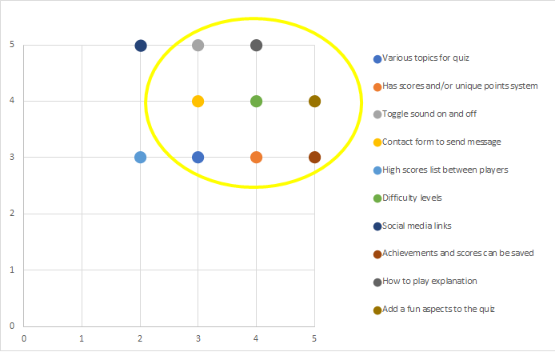

# Trivia World

  

[View live website here](https://dissyulina.github.io/trivia-world/index.html)

 

**Table of Contents**

------

## Introduction   
Welcome to the Trivia World! 
Trivia World is a website-based quiz/ trivia game in various topics such as Sports, Geography, History, Arts, Music, and Science. The game also features a spinning wheel to assign a topic and a stars achievement system that differentiates it from other quiz games. It also saves scores in the user’s local storage so the user can resume the game and allows multiple user names on the same device.    

Please note that this website game was created for the Code Institute’s Milestone Project 2 as part of their Diploma in Full Stack Software Development. The requirements are to make an interactive front-end website, using HTML, CSS, JavaScript. The site should respond to the users’ actions, allowing users to actively engage with data, alter the way site displays the site displays the information to achieve their preferred goals.   

 

## UX Development Plane   
### 1. Strategy Plane   

#### **User Stories**   
Strategic UX research was done through interviews with a few potential users. 
- **First Time Visitor Goal**   
   As a first time visitor, I want to:   
   a. Easily navigate throughout the site between pages, to play or to quit the game.   
   b. Play the game intuitively without first reading the instruction.  
   c. Finding the instructions on how to play the game if it is needed. 
   d. Be able to choose different topics. 
   e. Play the game with a great user interface visually.  
   f. Have clear information/ heads up display inside the quiz’s questions, i.e. which topic I get, how much point does this question is worth, the progress bar, etc.  
   g. View my achievements.  
   h. Be able to save my achievements so that I can resume them later.   
   i. Be able to change player/ username so my friends can try to play it on the same device.   
   j. Play a game with sound effects which will enhance the gaming experience.   
   k. Toggle the sound on and off.   

- **Returning/ Frequent Time Visitor Goal**   
   As a returning / frequent visitor, I want to:  
   a. Resume the playing that I did before, with my achievement still saved in the game.   
   b. Send suggestions to the developer to improve the game.  
   c. Know in which topics I have full achievements. 
   d. To be challenged with different difficulty levels. 

 

#### **Online Research**
As a part of the planning process, online research was done to gain some inspiration on UI and UX of a quiz game, including:
1. [Squla](https://leukleren.squla.nl/demo) app
2. [Kahoot!](https://kahoot.com/)
3. Similar quiz games created by Code Institute peers (searched in channel peer-code-review in Slack)   
 

#### **Project Goals**  
The primary goal of Trivia World is to provide a web-based interactive quiz game, that is different from other typical quiz games. The game has to be fun and challenging to attract users to play the game until they can achieve rewards.   
    

#### **Player Goals**   
The target user for this game is:
-	Late teens to adult, 15 – 40 years old  
-	Consider themselves quite knowledgeable in various topics  
-	Enjoys quiz games  

The player is looking for:
-	A fun and challenging quiz game to play
-	Stars to be achieved, that creates a sort of goals/ target to be accomplished from the game.
-	Scores and achievements that can be saved  
 

#### **Developer Goals**   
The developer is looking to:
-	Create a fun game that they would play themselves
-	Demonstrate their skills and logic in using JavaScript, fetch API, and using local storage effectively.   

#### **Strategy Table**  
Based on the user stories and goals above, I brainstormed all of the opportunities that could be implemented in the game. All of these opportunities were mapped based on their importance (driven by goals and user needs), and viability (given limited time and resources), to determine which opportunities were going to be included and which were not.   
Opportunities / Features | Importance | Viability
   --- | --- | ---
   A. Various topics in a quiz | 3 | 3
   B. Has scores and/or unique points system | 4 | 3
   C. Toggle sound on and off | 3 | 5
   D. Contact form to send message | 3 | 4
   E. High scores list between players | 2 | 3
   F. Difficulty levels | 4 | 4
   G. Social media links | 2 | 5
   H. Achievements and scores can be saved | 5 | 3
   I. How to play explanation | 4 | 5
   J. Add a fun aspect to the quiz | 5 | 4

The chart below is the mapping of all of the opportunities. The yellow circle signifies which opportunities/ features have the highest combination of importance and viability.   

   

### 2. Scope Plane  
Based on the mapping in the Strategy Plane, I decided to include these features below in the game.
1.	A spinning wheel   
A spinning wheel is used to decide which topic the user will get. 
Instead of letting the user straightforwardly choose the topic, I decided to incorporate a spinning wheel to decide which topic the user will get. A spinning wheel serves two main purposes of the mapping in the Strategy Plane, which are:   
    -	Gives various topics to the game, and acts as a decision-making tool.   
    -	Adds a fun aspect of the game, as many people enjoy spinning the wheel.   
2. Unique score/ points system   
 I decided to make a unique points system as follows:   
   -	Every question is assigned points if answered correctly
   -	For every 1000 points reached in a topic, the user will be rewarded a star in that topic.
   -	The user can get a maximum of 3 stars on each topic. When a topic has 3 stars, the achievement for that topic is completed.  
3. Points and stars are saved in the local storage of the user’s device   
The achievements - points and stars, would be saved in the local storage of the device. At the landing page, the user is asked to input the username. If the username exists, the game will load the achievements. This allows the user to resume the game whenever they like, and other users can also use the same device and create their username.   
4. Difficulty level goes up after each star achieved   
Players can enjoy being challenged in the game because as the player reaches a star, the difficulty level of the next set of questions goes up as well.
    - For users that have 0 stars on a topic, the difficulty level of the corresponding topic is Easy.
    - For users that have 1 star on a topic, the difficulty level of the corresponding topic is Medium.
    - For users that have 2 and 3 stars on a topic, the difficulty level of the corresponding topic is Hard.   
5. How to play explanation   
The user can access a How to Play page if they need it. In the game, I will use descriptive messages, buttons, and other established conventions, therefore the user can play the game intuitively without checking out the rules/instructions first.     
6. Contact form   
The user can easily contact the developer through a contact form.   

And some functionalities in the game to guarantee the user has a great user experience:
1. The user can toggle the sound button on and off
2. The user can navigate easily through the game, quit or play again    
  

 

### 3. Structure Plane  
The game was organized in a Hierarchical Tree Structure that ensures the user can navigate easily and intuitively.   

   

There are 6 pages in planning: 
1. Landing page, as a main menu page.    
2. Spinning Wheel page, where the user chooses a topic.   
3. Questions page, where 10 set of questions in that topic appears one by one.   
4. Stars Achievement page, where the user can see all the stars that they have earned.   
5. How to Play page, where the user can find the instructions or rules for the game.   
6. Contact page, where the user can send a message to the developer via a contact form.   

    

### 4. Skeleton Plane  
Wireframes were created using Figma to design the navigation and interface of the website. One wireframe was created for mobile devices, according to the mobile-first design approach. The wireframe was only a rough sketch design of each page plus modal pop-ups.    

 

    

### 5. Surface Plane  
For a better and clearer visualization before coding, and also to check if the color scheme and images match and work great together, a high-fidelity mockup for mobile, tablet, and desktop was made and can be found below.

High fidelity mock-up for mobiles:
   

High fidelity mock-up for tablets:
 

High fidelity mock-up for desktops:
 
 

   #### **Color Scheme**  
   The overall theme of the game was blue and green, which were derived from the hero image. Using [Coolors](https://coolors.co), I add three colors from the hero image, and the yellow color of the star image, and then I generated one more color that fits well with those three colors. The result was a magenta color and I will use this color for all buttons.     
     

   #### **Typography**  
   All of the fonts were sourced from [Google Fonts](https://fonts.google.com).   
   - Main font: Open Sans   
   Open Sans is used as the main font, for all paragraphs and buttons. Open Sans was chosen because it has a modern and clean style. Also following the recommendation in Google fonts of popular pairing font with Pacifico.   
   - Secondary font: Pacifico    
   Pacifico is used as the header (h1 – h5) font for the website. It was chosen first since I wanted to choose a beautiful and impactful font for all headers.   
   - Tertiary font:   
   The tertiary font is just used for the game title on the landing page. I wanted to use a fun a thick font to grab the user’s attention since that is the first impression of the website from the user’s perspective.   

   #### **Imagery**  
   - Hero Image was chosen because it’s bright, fun, and capturing attention on the first impression. It is also picturing a curve landscape that corresponds to the “World” word of “Trivia World”.   
   - Every image inside the game were carefully chosen to corresponds with each other, mostly using a blue color theme.   
   - Icons in the achievement page were chosen to keep the blue color theme aligned with other images.   
   - Star image was the only one that differs from the entire theme, as it has a fun and cartoonish feel to it. It was chosen so that it stands out within the game so that the player can differentiate it from the other background images.

    

## **Features**  
### **Existing Features**  
#### **General Design Features**  
   - Each page of the game is fully responsive on all device sizes and features intuitive navigational buttons.   
   - Footer is available at the bottom of all pages, and the same for all pages to ensure easy control and navigation. In the footer there are:   
      * Toggle sound on and off, to allow users to mute or to play the sound no matter on which page the user is currently at.   
      * Access button to the achievement page, to allow users to go straight to their achievement page.  
      *  Copyright remarks and links to the developer’s GitHub and LinkedIn.   
   - Quit button functions to quit the game, save the users’ achievements, and bring the users back to the Landing Page. This button is placed on all the pages, except in the middle of the 10 questions on the Question page. However, after the 10 questions are finished, a modal pops up, and the users can click the Quit button to quit the game.   
   - Sound effects were added across the game to enhance user experience in playing the game:   
      * On the wheel when it’s spinning   
      * On modal pop-up after the wheel spun (topic result from the spinning wheel)   
      * On the answer choice if it’s clicked as an auditory response, if the answer is correct or wrong   
      * On modal pop-up, after 10 questions are up   
      * On modal pop-up when the user reaches a star   

#### **Page Design Features**  
   

---

