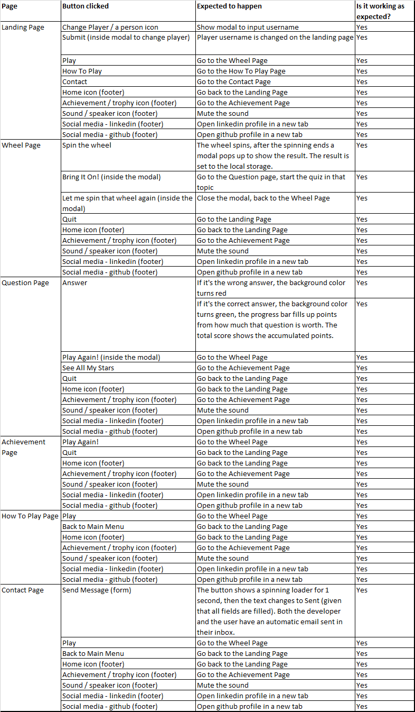
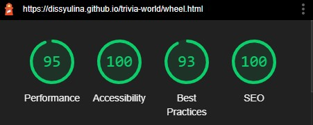

# Trivia World - Testing  

[Back to the main README.md file](https://github.com/dissyulina/trivia-world#trivia-world)  

[Back to the Testing section in main README.md file](https://github.com/dissyulina/trivia-world#testing)  

[View live website here](dissyulina.github.io/trivia-world/)  

<br/>  

**Table of Contents** 
1. [User Stories Testing]()  
2. [Manual Testing]()  
   a. [Responsiveness Testing]()  
   b. [Links Testing]()  
   c. [Forms Testing]()  
3. [Autoprefixer CSS]()  
4. [W3C Validator Testing]()  
5. [Lighthouse Testing]()  
6. [CI Peer Code Review on Slack]()
7. [Further Testing]()  

<br/>  

---  


## **User Stories Testing**
 - **First Time Visitor Goal**   
    As a first time visitor, I want to:  
    - Easily navigate throughout the site between pages, to play or to quit the game.   
       * To play the game, the user can click the Play buttons which are available throughout the website, so that the user doesn’t have to go back to the main menu first. As explained in the Features section of the Readme, the Play Button is available on the Landing Page, How To Play Page, Contact Page, on modal pop up after the questions are done, and on the Achievement Page.  
       * To quit the game, the user can simply click the Quit button on the Wheel page and the Achievement page. However, the user can not quit the game in the middle of answering the 10 questions, as that is one of the rules of the game. After answering 10 questions or after getting a star, a modal will pop up, and only then the Quit button is made available to the user.  
       * The Footer is displayed at the bottom of every page. In the footer, the user can navigate easily to the Achievement Page and can toggle the sound on/ off as well.  

    - Play the game intuitively without first reading the instruction.  
       * Icons were used conventionally for buttons to allow the user to click intuitively.  
       * Play buttons are designed differently as the main button / call-to-action button with a magenta background color, as a subtle lead for users to find their way to play the game. 
       * The modals are designed and written instructively, with a short informative explanation to the user of what will happen next.  
    
    - Finding the instructions on how to play the game if it is needed.  
       * How To Play page is easily accessible on the landing page/ main menu.  
       * The modals are designed and written instructively, with a short informative explanation to the user of what will happen next.  
    
    - Be able to choose different topics.  
       * The topic is determined through spinning the wheel, which also adds a fun aspect to the game.  
    
    - Play the game with a great user interface visually.  
       * The background/hero image on the landing page fits 100% of the viewport width and height, capturing the attention of first-time users.  
       * Every page is designed with a fun and colorful UI in mind.  

    - Have clear information/ heads up display inside the quiz’s questions, i.e. which topic I get, how much point does this question is worth, the progress bar, etc.  
       * A Heads Up Display consisting of which topic it is, how many points the user currently has, how many points this question is worth, and the difficulty level of the question.  
       * A progress bar of the points is displayed at the top of the page, with a scale of 1000. When the progress bar is full, the star turns yellow, which means the user gets an additional star.  

    - View my achievements. 
       * The button to access the Achievement Page is available in the footer on every page, allowing the user to directly access it from whichever page the user is currently on.  
       * There is also a 'See All My Stars' button inside the modal after the users answer 10 questions or after the users get a star, which will also lead to the Achievement Page.  

    - Be able to save my achievements so that I can resume them later.  
       * The achievement is saved on the local storage of the user’s device.

    - Be able to change player/ username so my friends can try to play it on the same device.  
       * A Change Player button is conventionally positioned at the top left of the Landing Page, and using a person icon, which is a common icon for login. 
    
    - Play a game with sound effects which will enhance the gaming experience.  
       * Sound effects are played on many parts of the game, which include:  when the wheel spins when a modal pop up, and when an answer is clicked.  
    
    - Toggle the sound on and off.  
       * The user can toggle the sound on and off by clicking the sound toggle button, inside the footer, that is available on all pages.  
    

 - **Returning Visitor Goal**  
   As a returning / frequent visitor, I want to:  
   - Resume the playing that I did before, with my achievement still saved in the game.   
      * When the users open the game again on the same device, the game automatically loads up the data of the last player that played the game before.  
      * If the user was not the last player that played the game on that device, the user can click the Change Player button on the top right of the landing page, and input the username there.   

   - Send suggestions to the developer to improve the game.  
      * To send suggestions or other messages to the developer, the user can use the contact form on the Contact Page. After a valid form is sent, the Send button will turn to “Sent”, and the user will receive a confirmation email in their inbox.  

   - Know in which topics I have full achievements.  
      * The user can go to the Achievement Page to see all-stars that they have achieved. For full achievement (3 stars) in a topic, there will be an additional “complete” sign below the stars.   

   - To be challenged with different difficulty levels.  
      * The difficulty level goes up every time the users get a star in that topic (0 star : medium, 1 star: medium, >=2 stars : hard).  

<br/>  

## **Manual Testing**
### **Responsiveness Testing**   
To check the responsiveness of the website across all devices, the developer tools are used regularly during the developing process. Please note that due to the gifs' resolutions, the colors on the demonstration below might be different from the actual site.  
- The responsiveness of the Landing Page   
      

- The responsiveness of the Wheel Page   
      

- The responsiveness of the Question Page  
    
 
- The responsiveness of the Achievements Page  
    

- The responsiveness of the How To Play Page  
    

- The responsiveness of the Contact Page  
    


<br/>

### **Links Testing**
The links were tested to ensure that:  
- All navigation links are linking correctly.   
- The social media buttons are working and opening in a new tab.  
-  Hovering and active states are working.  
I did the testing of all buttons and any clickable elements in the game. Below is the result.  

  

### **Game Play Testing**
The game play was tested to ensure that:
- All modals are showing as intended.
- The progress bar is working perfectly without a glitch.
- All points and stars calculations are working.
- All features of the game itself function properly.  

  

### **Forms Testing**
The forms were also tested to ensure that:  
- The ```required``` attributes are working (attached to all fields - name, email address, and message).  
- When a valid form is submitted, the Send Message button turns to a spinning loader for 1 second, and then turns to Sent. 
- The developer gets the notification message in their inbox.
- The users get a thank you message in their inbox 

All of the above are working properly.

<br/>  

## **Autoprefixer CSS**
Autoprefixer CSS was used to add CSS vendor prefixes to the CSS rules after the developing process was done, to ensure that the they work across all browsers.  

<br/>  

## **W3C Validator Testing**  
The [W3C Markup Validator](https://validator.w3.org) and [W3C CSS Validator](https://jigsaw.w3.org/css-validator/) were used to validate the website to ensure there were no syntax errors in the project. The results are below:  

### **HTML**
No errors were found, but there were some warnings at the first test. The warnings were all the empty header tags that I used inside a modal, to then be filled dynamically with JavaScript. I filled in those header tags with a text and put the Html file back to the test. In the end, no warnings or errors were found on all pages.

1. [The Landing Page (index.html)](assets/testing/html-validator/index-test.jpg)  
2. [The Wheel Page (wheel.html)](assets/testing/html-validator/wheel-test.jpg)   
3. [The Question Page(question.html)](assets/testing/html-validator/question-test.jpg)   
4. [The Achievements Page (achievements.html)](assets/testing/html-validator/achievements-test.jpg)   
5. [The How To Play Page (howtoplay.html](assets/testing/html-validator/howtoplay-test.jpg)   
6. [The Contact Page (contact.html)](assets/testing/html-validator/contact-test.jpg)   

### **CSS**
No errors were found, but there are 61 warnings and they are all concerning the vendor prefixes. I decided to ignore the warnings because the vendor prefixes are important to ensure that the styling works across different browsers. [The screenshot of the result can be found in this link](assets/testing/css-test.jpg)  


<br/>  

## **JavaScript Testing**  
I ran the code through [JSHint](https://jshint.com/), and there were some warnings. All of the warnings have been fixed, except for one warning which shows ```emailjs``` as an undefined variable. However, ```emailjs``` is an external variable from a service that allows sending email from JavaScript, so it's not defined inside the js file. The summary of the warnings that I got from the JSHint test and the actions that I took to solve them can be found in the table below.  

  

- ``` achievement.js ``` : [The screenshot of the final result can be found in this link](assets/testing/jshint/achievements-jshint.jpg)  
- ``` contact.js ``` : [The screenshot of the final result can be found in this link](assets/testing/jshint/contact-jshint.jpg)  
- ``` question.js ``` : [The screenshot of the final result can be found in this link](assets/testing/jshint/question-jshint.jpg)  
- ``` script.js ``` : [The screenshot of the final result can be found in this link](assets/testing/jshint/script-jshint.jpg)  
- ``` sound.js ``` : [The screenshot of the final result can be found in this link](assets/testing/jshint/sound-jshint.jpg)  
- ``` wheel.js ``` : [The screenshot of the final result can be found in this link](assets/testing/jshint/wheel-jshint.jpg)  


## **Lighthouse Testing**  
The Chrome Lighthouse testing was used to audit the performance, accessibility, best practices, and SEO. Below are the result.
- For the landing page (index.html) : desktop and mobile 

   *    

   *    

- For the wheel page (wheel.html) : desktop and mobile  

   *    

   *    

- For the question page (question.html) : desktop and mobile  

   *   

   *   

- For the achievements page (achievements.html) : desktop and mobile  

   *   

   *   

- For the how to play page (howtoplay.html) : desktop and mobile  

   *   

   *   

- For the contact page (contact.html) : desktop and mobile  

   *   

   *   

<br/>

## **CI Peer Code Review on Slack**  
The website was also submitted to the Peer-code-review channel on Slack to get some feedback. The feedback I got was from a fellow student, Daniel_C_5p, that on small screens, the footer (on the landing page, the wheel page, and the question page) covers the buttons and some of the content above it. That happened because I used position absolute for the footer and set the height of the page to 100vh. Although along the process of making it I was actively using the Developer Tools and had made sure the design looks good on a screen as small as iPhone 5,  it still displayed distorted on his phone, an iPhone 8.  

Based on the feedback above, these changes were made:  
I decided to change my approach, and change the position absolute to position static (default), and turn the parent of the footer into a flexbox container, in combination with justify content between, so that the footer stays at the bottom. I also took out the height of the page 100vh, and change it to minimal height 100vh.   

<br/>  


## **Further Testing**  
- The Website was tested on Google Chrome, Microsoft Edge, Opera, Mozilla Firefox, and Safari (iOS) browsers.
- The website was viewed on a variety of devices such as:
   - Windows Desktop 
   - Windows Laptop  
   - Tablets: iPad Mini 2 and iPad 2018
   - Mobile: iPhone7, iPhone 8, iPhone 12 Mini, Asus Zenfone Max Pro M2, and LG G5  
- Friends and family members were asked to review the site and to point out any bugs and/or user experience issues.

<br />

[Back to top](https://github.com/dissyulina/trivia-world/blob/main/TESTING.md#trivia-world---testing)  
